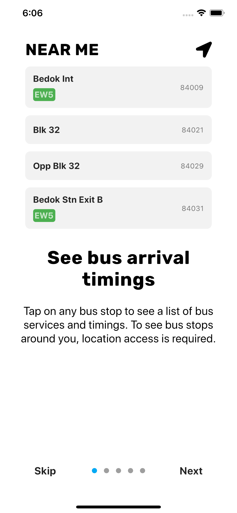
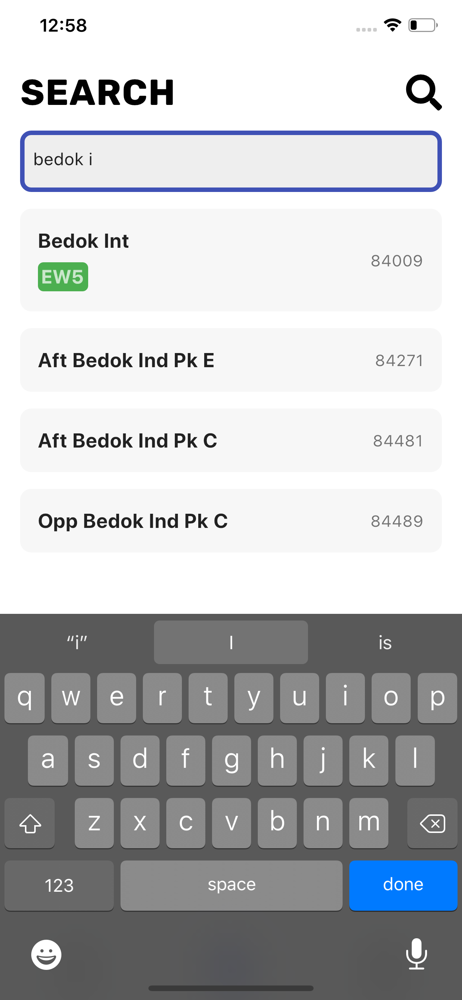
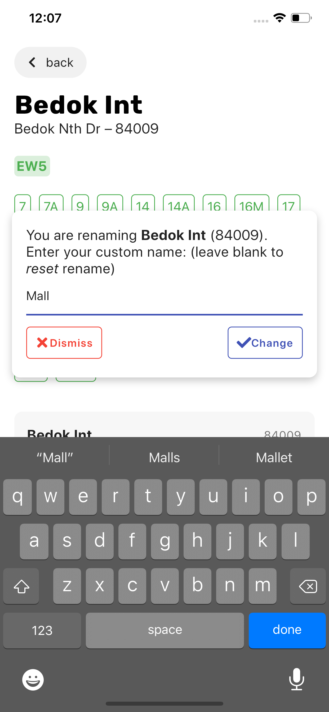

<h1 align="center"> 🚍 NextBus SG</h1>

<p align="center">An app to show everything bus related in Singapore, including <b>bus arrival times</b> and a <b>directory</b>, with <b>extra features</b>.</p>

<a href='https://play.google.com/store/apps/details?id=com.themindstorm.nextbussg&pcampaignid=pcampaignidMKT-Other-global-all-co-prtnr-py-PartBadge-Mar2515-1'></a>

## 🎆 Gallery


## 🚀 Features
- [x] Show the arrival times of buses at stops near the user
  - [x] Show a list of buses not currently in serivce
  - [x] Show if a bus stop is also an MRT station in the search page
  - [x] Show which all bus stops around the user are also MRT stations (~~needs help~~) ([#2](https://github.com/themindstorm/NextBusSG/issues/2))
  - [x] Show the load of buses (green for not crowded ...)
  - [ ] Show timings for college buses (NUS, NTU, SUTD, ...), although still need to collect data for these (check out [this](https://github.com/themindstorm/singapore-bus) repository for updates)
- [x] Ability to save buses at a particular stop as a favorite
  - [x] Confirm user's action of adding/removing from favorites using bottom sheets
    - [ ] Display a toast when a favorite has been added/removed to notfy the user of their actions
  - [x] Automatically show the arrival time of favorite buses at stops (if user is at stop)
  - [x] Add ability to view all favorites in a ~~popup~~ page
  - [x] Show message prompting user to add a favorite if there are no favorites
  - [x] Custom names for favorites
- [x] Ability to search for bus services, routes, and stops (Search page)
  - [x] See information for each bus stop
  - [x] See information for each bus service
    - [x] See a list of routes for each bus service
  - [ ] See information for each MRT station (unplanned)
- [x] FAQ page to teach users how to use the app
- [x] Onboarding (introduction) pages to show how to use the app
- [x] Third page (settings/options page, should also show tutorial/FAQ on how to use the app)
- [x] Request user location permission on app start
  - [x] Display button to open settings if location permissions denied
- [ ] Add quick actions to go to favorites and MRT map (implemented, but not working on IOS: [#13634](https://github.com/flutter/flutter/issues/13634))
- [x] Theme customization 
  - [x] Light/dark theme
    - [ ] Change status bar text color depending on theme
  - [ ] Accent color (unplanned) (~~might not implement~~) (only blue, green, and light blue)
  - [ ] Change font size (unplanned) (might not implement)
- [ ] **THINK OF A MORE CREATIVE NAME.**

### 🧨 For the future
- [ ] Graph view for arrival times, rather than just showing numbers (planned, although implementation is difficult)
- [ ] AR navigation
- [ ] Tell users how to get to the nearest bus stop (unplanned)
- [ ] Map view to show the nearest bus stops (unplanned) (might not implement)

### [Wiki](https://github.com/themindstorm/NextBusSG/wiki)

## 🛠 Data
Check out [themindstorm/singapore-bus](https://github.com/themindstorm/singapore-bus) for a detailed guide on how the data was scraped. The data is copyrighted by LTA.

## 📦 Packages used
- provider
- hive
- hive_flutter
- hive_generator
- geolocator
- permission_handler
- styled_widget
- flutter_markdown
- bot_toast
- url_launcher
- introduction_screen
- flutter_launcher_icons
- flutter_native_splash
- quick_actions

## Other information
- [Data](https://github.com/themindstorm/singapore-bus) collection start date: February 11, 2020
- Project start date: February 13, 2020 

## Built setup
Your system requires the Flutter SDK. Follow the steps here to [install](https://flutter.dev/docs/get-started/install) it on your system.

1. Clone or fork this repository.
2. In the `lib` folder, create `keys.dart`.

In `keys.dart`, paste the following:

```
final String apiKey = '<LTA API KEY>';
```

To get an API key, go to [LTA's Request For API Access web page](https://www.mytransport.sg/content/mytransport/home/dataMall/request-for-api.html) and fill out the form. The key is **required** for the app to work properly.

Once the key as been set up, the app can be tested with the following commands:
```
flutter run
```

### Generating icons and splash screens
After updating `pubspec.yaml`, run these commands:
```
flutter pub run flutter_launcher_icons:main
flutter pub pub run flutter_native_splash:create

```

### Stuck at installing debug Android app?
Go to app settings and uninstall your app. The app may not appear in your launcher, but it could still be installed. Go to your settings, find it, and completely uninstall it.

This can also be done using ADB:

```
adb uninstall com.themindstorm.nextbussg
```

If this does not work, check out this [answer on SO](https://stackoverflow.com/questions/53394504/flutter-stuck-at-installing-build-app-outputs-apk-app-apk).

### Build Android APK and appbundle
```
flutter build appbundle
flutter build apk
```

Once the APK has been built, install it on a physcally connected Android device:
```
flutter install
```

If you have multiple devices, you can view a list of Android devices connected using this command:

```
adb devices
```

And to install the app on an Android device, copy the device ID and install the app using

```
flutter install <devce ID>
```


## Detailed images
| UI                                                                 | Description                                                                                                                         |
| ------------------------------------------------------------------ | ----------------------------------------------------------------------------------------------------------------------------------- |
|            | **Onboarding screen**, where the user is asked for the location permission                                                          |
|                | **Main page**, where users see a list of bus stops near them (and favorites), and see their respective bus arrival timings          |
|  | Users are prompted to confirm                                                                                                       |
|           | **Favorites** that are close to the user are show on the main page                                                                  |
|                 | **Search page**                                                                                                                     |
|            | **Bus stop details** page                                                                                                           |
|      | Bus service details page                                                                                                            |
|                | **More page**, where users can change settings and see some more features                                                           |
|            | 🌙 **Dark theme**                                                                                                                    |
|                      | Bus stops can be renamed (renamed bus stops in italics)                                                                             |
|        | **Quick actions!** These do not seem to be working on iOS at the moment: [#13634](https://github.com/flutter/flutter/issues/13634). |

[This](https://imgur.com/a/8QOCKBy) and [this](https://imgur.com/a/wXQWfeq) was what the design looked like at first.


## Acknowledgements
This app makes use of data and images (MRT map) from:
- LTA (Land Transport Authority): https://www.mytransport.sg/content/mytransport/home/dataMall.html
- LTG (Land Transport Guru): http://landtransportguru.net


## License
[MIT](https://github.com/themindstorm/NextBusSG/blob/master/LICENSE)

## Legal attribution
Google Play and the Google Play logo are trademarks of Google LLC.