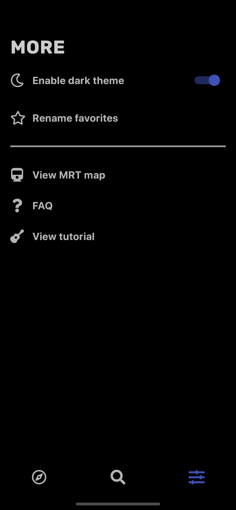

<h1 align="center"> 
  🚍 NextBus SG
</h1>

> An app to show everything bus related in Singapore, including **bus arrival times** and a **directory**, with **extra features**

<!--  -->

## 🎆 Gallery (WIP)

| UI | Description |
| - | - |
| | **Onboarding screen**, where the user is asked for the location permission |
| | **Main page**, where users see a list of bus stops near them (and favorites), and see their respective bus arrival timings |
| | All **favorites page** |
| | **Search page** |
| | Bus stop details page |
| | Bus service details page |
|  | **More page**, where users can change settings and see some more features |
| | 🌙 **Dark theme** |
| | Bus stops can be renamed (renamed bus stops in italics) |

## 🚀 Features
- [x] Show the arrival times of buses at stops near the user
  - [x] Show a list of buses not currently in serivce
  - [x] Show if a bus stop is also an MRT station in the search page
  - [x] Show which all bus stops around the user are also MRT stations (~~needs help~~) ([#2](https://github.com/themindstorm/NextBusSG/issues/2))
  - [x] Show the load of buses (green for not crowded ...)
  - [ ] Show timings for college buses (NUS, NTU, SUTD, ...), although still need to collect data for these (check out [this](https://github.com/themindstorm/singapore-bus) repository for updates)
- [x] Ability to save buses at a particular stop as a favorite
  - [x] Confirm user's action of adding/removing from favorites using bottom sheets
    - [ ] Display a toast when a favorite has been added/removed to notfy the user of their actions
  - [x] Automatically show the arrival time of favorite buses at stops (if user is at stop)
  - [x] Add ability to view all favorites in a ~~popup~~ page
  - [x] Show message prompting user to add a favorite if there are no favorites
  - [x] Custom names for favorites
- [x] Ability to search for bus services, routes, and stops (Search page)
  - [x] See information for each bus stop
  - [ ] See information for each bus service
    - [ ] See a list of routes for each bus service
  - [ ] See information for each MRT station (unplanned)
- [x] FAQ page to teach users how to use the app
- [x] Onboarding (introduction) pages to show how to use the app
- [x] Third page (settings/options page, should also show tutorial/FAQ on how to use the app)
- [x] Theme customization 
  - [x] Light/dark theme
    - [ ] Change status bar text color depending on theme
  - [ ] Accent color (unplanned) (~~might not implement~~) (only blue, green, and light blue)
  - [ ] Change font size (unplanned) (might not implement)

### 🧨 For the future
- [ ] Graph view for arrival times, rather than just showing numbers (planned, although implementation is difficult)
- [ ] AR navigation
- [ ] Tell users how to get to the nearest bus stop (unplanned)
- [ ] Map view to show the nearest bus stops (unplanned) (might not implement)

## 🛠 Data
Check out [themindstorm/singapore-bus](https://github.com/themindstorm/singapore-bus) for a detailed guide on how the data was scraped. The data is copyrighted by LTA.

## 📦 Packages used
- provider
- hive
- hive_flutter
- geolocator
- location_permissions
- styled_widget
- division
- flutter_markdown
- bot_toast
- url_launcher
- introduction_screen

## FAQs
### 1. How do I add or remove favorites?
- **Double tap** or **Long press** on any bus service tile, 
- The prompt to add/remove should appear
### 2. Why aren't all my favorites showing?
on the home page, only favorites that are **near** will be shown. To see all your favorites, click on the **"See all"** button.
### 3. How do I rename a bus stop?
There are two ways:
1. Either add the stop to your favorites, then go the "More" page (the third tab on the bottom bar), then tap **"Rename favorites"**, or
2. Search for the bus stop in the search page (second tab), and press the **"Rename"** button.
### 4. How do I see more information on a particular bus stop?
There are two ways:
1. Either tap the bus service tile's 5-digit code (ex: 84009), or
2. Search for the bus stop in the search page, tap on the results to see more information

## Other information
- [Data](https://github.com/themindstorm/singapore-bus) collection start date: February 11, 2020
- Project start date: February 13, 2020 

## Built setup
Your system requires the Flutter SDK. Follow the steps here to [install](https://flutter.dev/docs/get-started/install) it on your system.

1. Clone or fork this repository.
2. In the `lib` folder, create `keys.dart`.

In `keys.dart`, paste the following:

```
final String apiKey = '<LTA API KEY>';
```

To get an API key, go to [LTA's Request For API Access web page](https://www.mytransport.sg/content/mytransport/home/dataMall/request-for-api.html) and fill out the form. The key is **required** for the app to work properly.

Once the key as been set up, the app can be tested with the following commands:
```
flutter run
```

## Acknowledgements
This app makes use of data and images (MRT map) from:
- LTA (Land Transport Authority): https://www.mytransport.sg/content/mytransport/home/dataMall.html
- LTG (Land Transport Guru): http://landtransportguru.net

## (Move this to wiki later)
### Getting user location
#### iOS

Go to `ios/Runner/Info.plist`, and add 
```
<key>NSLocationWhenInUseUsageDescription</key>
<string>This app needs access to location when open.</string>
``` 

as a child to the `<dict>` tag.

#### Android
Go to `android/app/src/main/AndroidManifest.xml`, then add 
```
<uses-permission android:name="android.permission.ACCESS_FINE_LOCATION" />
```

as a child of the `<manifest>` tag.
